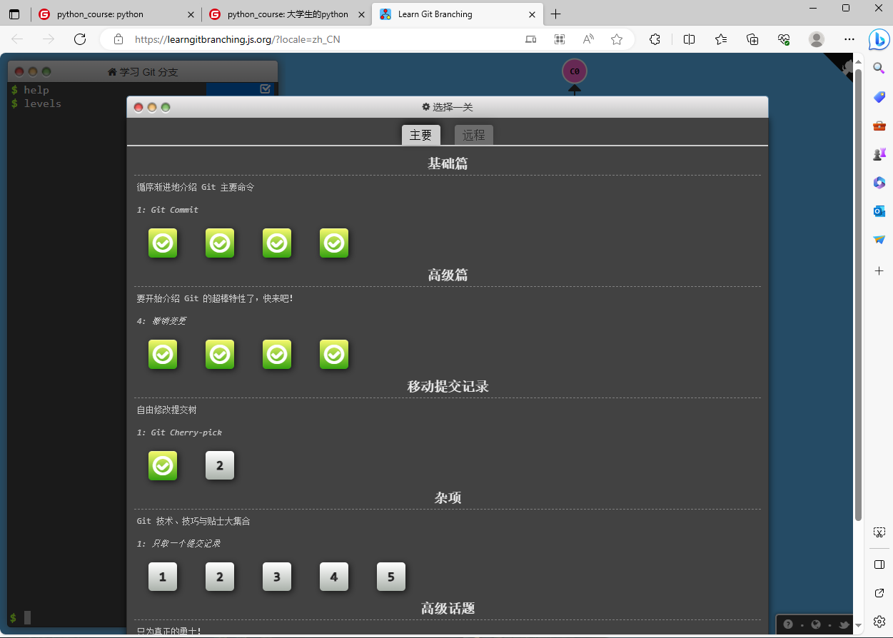
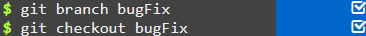
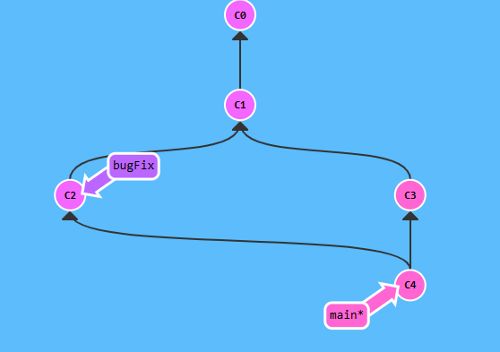

#  实验一 Git和Markdown基础
  
  
班级： 21计科04
  
学号： B20210302431
  
姓名： 许顶阳
  
Gitee地址：(https://gitee.com/xdyyyyyy/python_course)
  
---
  
##  实验目的
  
  
1. Git基础，使用Git进行版本控制
2. Markdown基础，使用Markdown进行文档编辑
  
##  实验环境
  
  
1. Git
2. VSCode
3. VSCode插件
  
##  实验内容和步骤
  
  
###  第一部分 实验环境的安装
  
  
1. 安装git，从git官网下载后直接点击可以安装：[git官网地址](https://git-scm.com/ )
2. 从Github克隆课程的仓库：[课程的Github仓库地址](https://github.com/zhoujing204/python_course )，[课程的Gitee仓库地址](https://gitee.com/zj204/python_course )，运行git bash应用（该应用包含在git安装包内），在命令行输入下面的命令（命令运行成功后，课程仓库会默认存放在Windows的用户文件夹下）
  
```bash
git clone https://github.com/zhoujing204/python_course.git
```
  
或者从gitee克隆课程的仓库：
```bash
git clone https://gitee.com/zj204/python_course.git
```
  
如果你在使用`git clone`命令时遇到SSL错误，请运行下面的git命令(这里假设你的Git使用了默认安装目录)：
  
```bash
git config --global http.sslCAInfo C:/Program Files/Git/mingw64/ssl/certs/ca-bundle.crt
```
  
该仓库的课程材料后续会有更新，如果需要更新课程材料，可以在本地课程仓库的目录下运行下面的命令：
  
```bash
git pull
```
  
3. 注册Github账号或者Gitee仓库，创建一个新的仓库，用于存放实验报告和实验代码。
4. 安装VScode，下载地址：[Visual Studio Code](https://code.visualstudio.com/ )
5. 安装下列VScode插件
   - GitLens
   - Git Graph
   - Git History
   - Markdown All in One
   - Markdown Preview Enhanced
   - Markdown PDF
   - Auto-Open Markdown Preview
   - Paste Image
   - markdownlint
  
###  第二部分 Git基础
  
  
教材《Python编程从入门到实践》P440附录D：使用Git进行版本控制，按照教材的步骤，完成Git基础的学习。
  
###  第三部分 learngitbranching.js.org
  
  
访问[learngitbranching.js.org](https://learngitbranching.js.org )，如下图所示完成Main部分的Introduction Sequence和Ramping Up两个小节的学习。
  

上面你学习到的git命令基本上可以应付百分之九十以上的日常使用，如果你想继续深入学习git，可以：
  
- 继续学习[learngitbranching.js.org](https://learngitbranching.js.org )后面的几个小节（包括Main和Remote）
- 在日常的开发中使用git来管理你的代码和文档，用得越多，记得越牢
- 在git使用过程中，如果遇到任何问题，例如：错误删除了某个分支、从错误的分支拉取了内容等等，请查询[git-flight-rules](https://github.com/k88hudson/git-flight-rules )
  
###  第四部分 Markdown基础
  
  
查看[Markdown cheat-sheet](http://www.markdownguide.org/cheat-sheet )，学习Markdown的基础语法
  
使用Markdown编辑器（例如VScode）编写本次实验的实验报告，包括[实验过程与结果](#实验过程与结果 )、[实验考查](#实验考查 )和[实验总结](#实验总结 )，并将其导出为 **PDF格式** 来提交。
  
##  实验过程与结果
  
  
###  附录D 使用Git进行版本控制
  
  
配置Git
  
```bash
git config --global user.name "username"
git config --global user.email "email"
```
  
  
###  learngitbranching.js.org练习
  
  
Introduction to sequence
1. git commit
git commit提交了一个新的commit，这个commit包含了当前工作目录的状态。这个commit的父节点是当前分支的最新commit。
  
  
```bash
git commit
git commit
```
###  实验过程与结果
  
  
  

```bat
git branch bugFix
git checkout bugFix
```
```bat
git branch bugFix
git checkout bugFix
git commit
git checkout main
git commit
git merge bugFix
```
 !
##  实验考查
  
  
请使用自己的语言回答下面的问题，这些问题将在实验检查时用于提问和答辩，并要求进行实际的操作。
  
1. 什么是版本控制？使用Git作为版本控制软件有什么优点？
  
```
版本控制是一种跟踪和管理项目文件和代码变化的系统。。它主要用于协作开发，跟踪项目的历史记录，恢复先前的版本，以及解决多人同时编辑代码可能引发的冲突。
优点：分布式控制，分支管理，历史追踪，团队协作，开源和社区支持
```
  
2. 如何使用Git撤销还没有Commit的修改？如何使用Git检出（Checkout）已经以前的Commit？（实际操作）
  
如果你对工作目录中的文件做了一些修改，但尚未提交这些更改，可以使用以下命令来撤销这些修改：
  
```bat
git checkout .
```
  
如果只想撤销特定文件的修改，可以使用以下命令：
```bat
git checkout -- filename
```
  
其中，filename是要撤销修改的文件名。这将把文件恢复到上一次提交的状态。
  
如果你想检出已经以前的提交（commit），可以使用以下命令：
  
```bat
git checkout <commit-hash>
```
  
其中，<commit-hash>是你要检出的提交的哈希值或分支名称。这个命令将使你的工作目录和版本库的状态回滚到选择的提交。
  
如果你只是想查看以前的提交而不更改你的工作目录状态，你可以使用以下命令：
  
```bat
git checkout <commit-hash> -- filename
```
  
  
这将检出指定提交中的特定文件，而不会改变你的工作目录中的其他文件。
  
  
3. Git中的HEAD是什么？如何让HEAD处于detached HEAD状态？（实际操作）
  
```
Git中的HEAD是一个指针，通常指向当前所在的分支，或者一个特定的提交。在Git中，可以通过命令行操作让HEAD处于detached HEAD状态。
  
如何让Git的HEAD处于detached HEAD状态：
  
首先，打开命令行终端，并切换到你的Git项目目录。
使用git log命令查看commit历史记录。找到你想要检出的commit的哈希值或简写。
使用git checkout <commit>命令来检出到指定的commit。请将<commit>替换为你想要检出的commit的哈希值或简写。
这样，你的Git HEAD就处于detached HEAD状态了。在这种状态下，你可以自由地查看和修改代码，不用担心对现有的分支造成影响。但要注意，在这种状态下，你无法直接创建新的分支，如果你想保留并继续开发新的特性，最好在检出后创建一个新的分支。
  
在实际操作中，如果已经处于detached HEAD状态，可以通过以下命令创建一个新的分支：
  
使用git branch <new-branch-name>命令来创建一个新的分支。请将<new-branch-name>替换为你想要创建的新分支的名称。
使用git checkout <new-branch-name>命令来切换到新分支。
版本控制是一种在开发过程中用于管理对文件、目录或工程等内容的修改历史，方便查看更改历史记录，并可备份以便恢复到以前的版本。
```
  
4. 什么是分支（Branch）？如何创建分支？如何切换分支？（实际操作）
  
  
在Git中，分支是一个非常重要的概念。分支用于在版本控制过程中，使用多条线同时推进多个任务。这意味着你可以在多个分支上并行开发，互相不耽误，互相不影响，从而提高开发效率。
  
创建分支的步骤如下：
  
1.首先，打开命令行终端，并切换到你的Git项目目录。
2.使用git branch命令查看所有的本地分支。其中标有*的表示当前的工作分支。
3.要创建新的分支，可以使用git branch <new-branch-name>命令。请将<new-branch-name>替换为你想要创建的新分支的名称。
4.切换到新分支，可以使用git checkout <new-branch-name>命令。请将
<new-branch-name>替换为你想要切换的新分支的名称。
  
切换分支的步骤如下：
  
1.打开命令行终端，并切换到你的Git项目目录。
2.使用git branch命令查看所有的本地分支。其中标有*的表示当前的工作分支。
3.要切换到已有的分支，可以使用git checkout <branch-name>命令。请将<branch-name>替换为你想要切换的分支的名称。
4.这样，你就可以在特定的分支上进行开发和测试，而不会对其他分支产生任何影响。如果某个分支的功能开发失败，可以直接删除这个分支，不会对其他分支产生任何影响。
  
  
5. 如何合并分支？git merge和git rebase的区别在哪里？（实际操作）
  
  
合并分支在Git中是一个常见的操作，通常用于将多个开发线（分支）合并到一起。Git提供了两种主要的方式来合并分支：git merge和git rebase。
  
git merge的工作方式是，找到两个分支的最近公共祖先，然后将其中一个分支（源分支）的所有提交应用到另一个分支（目标分支）上。所以，如果你在主分支（比如master或main）上创建了一个临时分支（比如dropdown）进行新功能的开发，当功能开发完成后，你可以用git merge命令将dropdown分支合并到master分支上。
  
具体的操作步骤是：
  
1.切换到主分支：git checkout master
2.合并分支：git merge dropdown。这会将dropdown分支的所有提交应用到master分支上。
3.这会生成一个新的提交，这个提交包含了两个分支的差异。这就是git merge的工作方式。
  
与git merge不同，git rebase的工作方式是将目标分支（当前分支）的提交应用到源分支上，然后将源分支的提交应用到目标分支上。这实际上是重建了提交历史，带来了更整洁的提交线。这意味着你可以通过git rebase来消除不必要的合并提交，让提交历史看起来更加清晰。
  
具体的操作步骤是：
  
切换到目标分支：
  
```bat
git checkout master
```
执行rebase命令：git rebase dropdown。这会将master分支上的提交应用到dropdown分支上，然后将dropdown分支的提交应用到master分支上。
在操作过程中，如果你遇到了冲突或者其他问题，需要手动解决。总的来说，如果你想要一个清晰的提交历史，那么可能会倾向于使用git rebase。如果你想要简单直接地合并两个分支，并且对提交历史不是那么在意，那么可以使用git merge。
  
6. 如何在Markdown格式的文本中使用标题、数字列表、无序列表和超链接？（实际操作）
  
```
markdown
# 一级标题  
## 二级标题  
### 三级标题  
#### 四级标题  
##### 五级标题  
###### 六级标题
创建数字列表：在Markdown中，可以使用数字和点（.）来创建数字列表。例如：
  
markdown
1. 第一项  
2. 第二项  
3. 第三项
创建无序列表：在Markdown中，可以使用短横线（-）或者星号（*）来创建无序列表。例如：
  
markdown
- 第一项  
- 第二项  
- 第三项
或者
  
markdown
* 第一项  
* 第二项  
* 第三项
创建超链接：在Markdown中，可以使用尖括号（<）和>来创建超链接。例如：
  
markdown
<https://www.example.com> 这是一段超链接</https://www.example.com>
以上是Markdown的基本语法，可以帮助您在文本中创建标题、数字列表、无序列表和超链接。
```
  
  
##  实验总结
  
  
总结一下这次实验你学习和使用到的知识，例如：编程工具的使用、数据结构、程序语言的语法、算法、编程技巧、编程思想。
  
```
学习完这次课程学会了一些基本的git用法和markdown的制作，学会了git 中的一些语法像git checkout ,branch等语法。
```
  