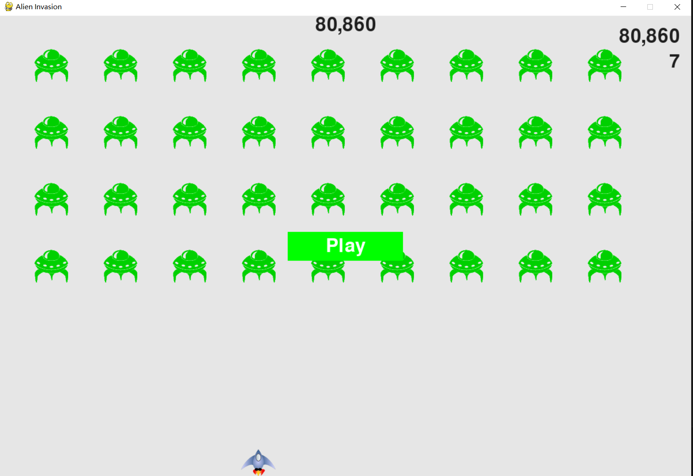

# 《Python程序设计基础》程序设计作品说明书

题目： 你选择的项目题目

学院： 21计科04

姓名： 徐享

学号： B20210302430

指导教师： 周景

起止日期：2023.11.10-2023.12.10

## 摘要

_介绍本次设计完成的项目的概述，本文的主要内容，总结你主要完成的工作以及关键词。

本次我选择的项目是外星人入侵小游戏，使用pip下载paygame库进行小游戏的编写，编写飞船控制函数对键盘进行监听让玩家能够通过键盘控制飞船消灭外星飞船。

关键词：

## 第1章 需求分析

1. 创建游戏需要用到的所有元素
2. 为所有玩家控制的元素编写控制函数，其次编写外星飞船npc元素
3. 对所有元素的动作编写函数
4. 对玩家的得分进行统计

_本章的内容主要包括系统的需求分析，系统主要需要实现的功能有哪些，可以帮助用户解决哪些问题等等。_

## 第2章 分析与设计

1. 首先想要玩这个小游戏，需要主文件alien_invasion.py创建一系列整个游戏都要用到的对象：存储在ai_settings中的设置、存储在screen中的主显示surface以及一个飞船实例。文件alien_invasion.py还包含游戏的主循环，这是一个调用check_events()、ship.update()和update_screen()的while循环。
要玩游戏《外星人入侵》，只需运行文件alien_invasion.py。其他文件（settings.py、game_functions.py、ship.py）包含的代码被直接或间接地导入到这个文件中。
2. 其次需要通过一个文件对小游戏的难度进行控制的设置文件settings.py包含Settings类，这个类包含方法__init__()、初始化游戏设置的方法initialize_dynamic_settings()、随游戏进程提高速度的方法increase_speed()。
3. 创建玩家控制的飞船类，这个类包含方法__init__()、管理飞船位置的方法update()、在屏幕上绘制飞船的方法blitme()以及让飞船在屏幕底部居中的方法center_ship()。表示飞船的图像存储在文件夹images下的文件ship.bmp中。
4. 创建入侵的外星飞船类，这个类包含方法__init__()、管理外星人位置的方法update()、检测外星人是否位于屏幕边缘的方法check_edges()以及在屏幕上绘制外星人的方法blitme()。表示外星人的图像存储在文件夹images下的文件alien.bmp中。
5. 创建玩家控制飞船射出的子弹类，这个类包含方法__init__()、管理子弹位置的方法update()以及在屏幕上绘制子弹的方法draw_bullet()。
6. 创建一个动作game_functions.py，它包含一系列函数，游戏的大部分工作都是由它们完成的。函数check_events()检测相关的事件，如按键和松开，并使用辅助函数check_keydown_events()和check_keyup_events()来处理这些事件。就目前而言，这些函数管理飞船的移动。模块game_functions还包含函数update_screen()，它用于在每次执行主循环时都重绘屏幕。
7. 创建游戏得分显示scoreboard.py包含Scoreboard类，这个类包含方法__init__()、渲染得分的方法prep_score()、渲染最高得分的方法prep_high_score()、渲染等级的方法prep_level()、渲染剩余飞船的方法prep_ships()及在屏幕上显示得分、最高得分、等级、飞船的方法show_score()。

_本章的内容主要包括系统的设计，例如：系统架构、系统流程、系统模块、数据库的设计，以及关键的实现，例如：使用的数据结果、算法。_

## 第3章 软件测试

_本章的内容主要包括以类和函数作为单元进行单元测试，编写的对系统的主要功能的测试用例，以及测试用例执行的测试报告。_

## 结论

游戏初期编写出了很多错误，如键盘输入却不能正常控制飞船的左右，只能一直向左或者一直向右，经过反复检查终于发现自己忘记对控制变量进行调整。最终实现了玩家控制飞船射出子弹消灭外星飞船并且对玩家得分进行计数，玩家通关后会不断加强难度，直到玩家出局，类似贪吃蛇的游戏模式。此小游戏仍然存在一定不足包括元素不够丰富，玩家可玩性不够，可以考虑添加关卡和添加其他元素boss增加游戏的可玩性。

_本章的内容主要是对项目的总结，项目主要实现了哪些功能，达到了哪些目标，哪些不足之处，可以如何改进。_

## 参考文献

**【python编程从入门到实践】**
